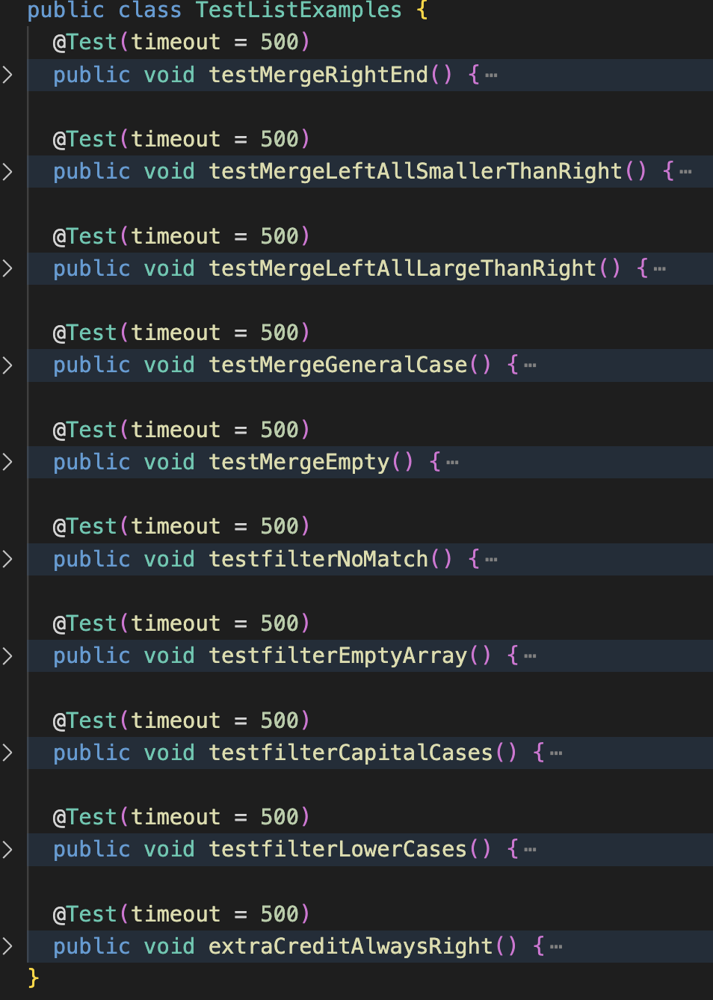

# Lab Report 5
Here I decide to finish `grade.sh` and demo it's features. 
## code overview
Below is the finished grader script overview
```
CPATH='.:lib/hamcrest-core-1.3.jar:lib/junit-4.13.2.jar'
# For Windows, revise CPATH to CPATH='.;lib/hamcrest-core-1.3.jar;lib/junit-4.13.2.jar'

rm -rf student-submission *.class *.txt ListExamples.java

git clone $1 student-submission 2>clone-result.txt
if [[ $? -ne 0 ]]
then 
    echo -e '\nClone Failed.'
    cat clone-result.txt
    exit
fi

echo -e '\nFinished cloning'

if [[ -f student-submission/ListExamples.java ]]
then
    cp student-submission/ListExamples.java ./
else
    echo -e 'student-submission/ListExamples.java not found'
    exit
fi

javac -cp $CPATH *.java 2>compile-err.txt
if [[ $? -ne 0 ]]
then
    echo -e 'Compile Failed'
    cat compile-err.txt
    exit
fi


java -cp $CPATH org.junit.runner.JUnitCore TestListExamples > exec-result.txt

grep "@Test" TestListExamples.java > number-tests.txt
TotalPoints=`wc -l < number-tests.txt`

grep ") " exec-result.txt > failed-tests.txt
LostPoints=`wc -l < failed-tests.txt`

let EarnedPoints=TotalPoints-LostPoints

echo -e '\nScore:'
echo -e $EarnedPoints " / " $TotalPoints

if [[ $EarnedPoints -ne $TotalPoints ]]
then 
    echo -e '\nFailed Tests Summary:'
    cat failed-tests.txt
fi

echo -e '\nAuto grading done\nThanks for using!'


```
## Analysis
```
rm -rf student-submission *.class *.txt ListExamples.java
```
remove all .txt files. Here, .txt files are used for standard output and standard error message. Also, it's used for grep to calculate grade.
```
git clone $1 student-submission 2>clone-result.txt
if [[ $? -ne 0 ]]
then 
    echo -e '\nClone Failed.'
    cat clone-result.txt
    exit
fi

echo -e '\nFinished cloning'
```
Clone the grading url. exit if clone fail.
```
if [[ -f student-submission/ListExamples.java ]]
then
    cp student-submission/ListExamples.java ./
else
    echo -e 'student-submission/ListExamples.java not found'
    exit
fi
```
If if desired submission file exist. If exist, copy to current working directly; otherwise, output error message.
```
javac -cp $CPATH *.java 2>compile-err.txt
if [[ $? -ne 0 ]]
then
    echo -e 'Compile Failed'
    cat compile-err.txt
    exit
fi
```
Compile java files and redirect compile error message to compile-err.txt. If compile fails, report error message stored in compile-err.txt and exit.
```
java -cp $CPATH org.junit.runner.JUnitCore TestListExamples > exec-result.txt
```
Execute TestListExamples class, and redirect test result to exec-result.txt
```
grep "@Test" TestListExamples.java > number-tests.txt
TotalPoints=`wc -l < number-tests.txt`

grep ") " exec-result.txt > failed-tests.txt
LostPoints=`wc -l < failed-tests.txt`

let EarnedPoints=TotalPoints-LostPoints
```
Grep failed test name to failed-tests.txt by grepping ") ". 

Calculate total number of tests (`TotalPoints`), and number of failing tests(`LostPoints`). Calculate credits student earned to `EarnedPoints` by `TotalPoints` minus `LostPoints`.
```
echo -e '\nScore:'
echo -e $EarnedPoints " / " $TotalPoints

if [[ $EarnedPoints -ne $TotalPoints ]]
then 
    echo -e '\nFailed Tests Summary:'
    cat failed-tests.txt
fi

echo -e '\nAuto grading done\nThanks for using!'
```
Format output. If student did not get full credit, report failed tests name stored in failed-tests.txt.

## Test Cases
There are totally 10 tests cases: 9 tests and 1 extra credit assigned to student for submitting homework.



## Different Submision Results
1. 